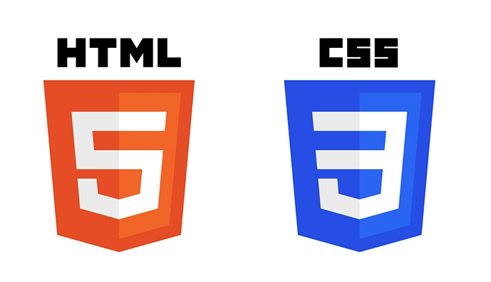

<h1 align="center">
  
 </h1>
 
<h3 align="center">
  Bootcamp - LAYOUT RESPONSIVO
</h3>

### Sobre o projeto
Criação de layout responsivo com HTML5, CSS3 usando Flex Layout e Media Query CSS3.

Você pode ver o projeto rodando em (https://raynegomes.github.io/bootcamp-layout-responsivo/).
